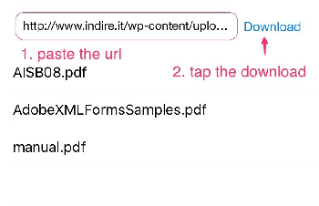
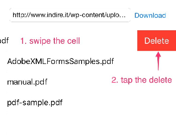

# PDFDownloader

Sample code for a PDF download and export.

## Description

PDFDwonloader is the iOS app that can download and export of pdf.  
Download the PDF from the any URL, you can export to the iBook and Evernote and the like.  
Programming language is written in swift2.0.  

## Usage

### Download PDF
1. paste the url
2. tap the download

### Export PDF
1. tap the cell
2. tap the export destination

### Remove PDF
1. swipe the cell
2. tap the delete

## Installation

    $ git clone https://github.com/amarron1/PDFDownloader.git
